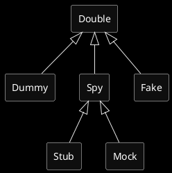

# 스프링부트 테스트 라이브러리 5종 해설

## 유튜브 영상
https://www.youtube.com/@hobbyMett

## vscode용 static import 설정

```
"java.completion.favoriteStaticMembers": [
        "org.springframework.test.web.servlet.result.MockMvcResultMatchers.*",
        "org.springframework.test.web.servlet.result.MockMvcResultHandlers.*",
        "org.springframework.test.web.servlet.request.MockMvcRequestBuilders.*",
        "org.assertj.core.api.Assertions.*",
        "org.junit.Assert.*",
        "org.junit.Assume.*",
        "org.junit.jupiter.api.Assertions.*",
        "org.junit.jupiter.api.Assumptions.*",
        "org.junit.jupiter.api.DynamicContainer.*",
        "org.junit.jupiter.api.DynamicTest.*",
        "org.mockito.Mockito.*",
        "org.mockito.ArgumentMatchers.*",
        "org.mockito.Answers.*",
        "org.hamcrest.Matchers.*",
        // "org.hamcrest.MatcherAssert.*"
    ],
```

## 테스트 Double 
- 외부 환경에 의해 영향을 받는 코드를 테스트하려면 가짜 객체를 이용하는 것이 효율적이다 (아래내용을 굳이 암기할 필요는 없다)
- Double : 대신 수행하는 것을 말한다. stunt man을 stunt double 이라고도 한다.
- Mockito는  Double을 다루는 프레임워크이다.



- Dummy : 단순히 자리만 채워넣는 것. JUnit 의 `anything()`
- Stub : 결과값을 정해놓고 검증
- Mock : 행위를 검증
- Spy : Mock + Stub
- Fake : 가짜객체를 실제와 가깝게 구현하여 검증

## JsonPath 사용법

### 표기법

- dot 표현식 : `$.store.book[0].title`
- bracket 표현식 : `$['store']['book'][0]['title']`

### 주요 연산자

- `$` : 루트 노드. 모든 path 표현식은 이 기호로 시작된다
    - (참고) `$..book[2]` 와 같이 `..` 를 사용하면 deep 검색
- `@` : 현재 노드. 필터 조건자에서 사용
- `*` : 와일드카드. 모든 요소와 매칭
- `.` : dot표현식에서 자식노드
- `[start : end]` : 배열 slice 연산자
- `[?(<expression>)]` : 필터 표현식. 예) book[?(@.price == 49.99)]

### 함수

- min(), max(), avg(), length() 등이 있다
- 표현식 맨 마지막에 붙여서 사용한다

### JsonPath에 사용된 샘플데이터
- https://jsonplaceholder.typicode.com/posts
- https://jsonplaceholder.typicode.com/users/1